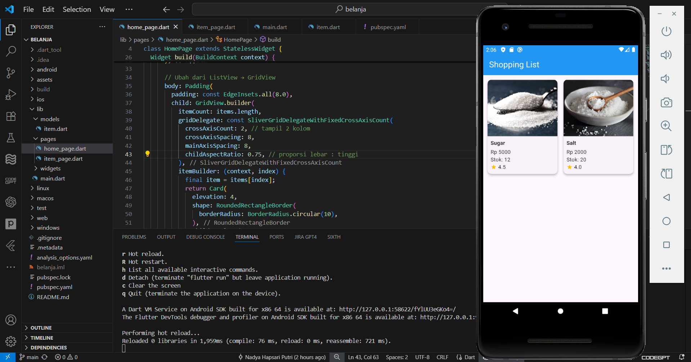
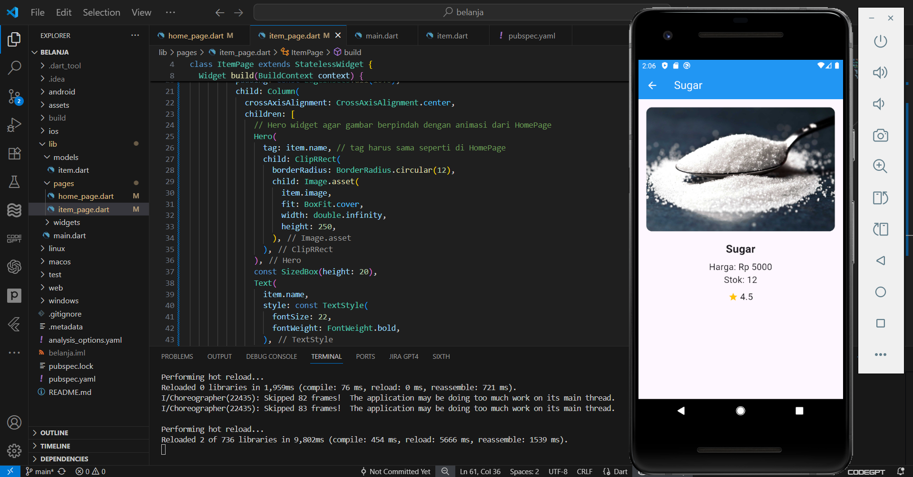
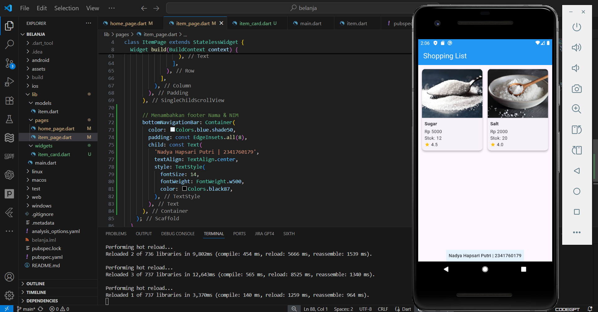
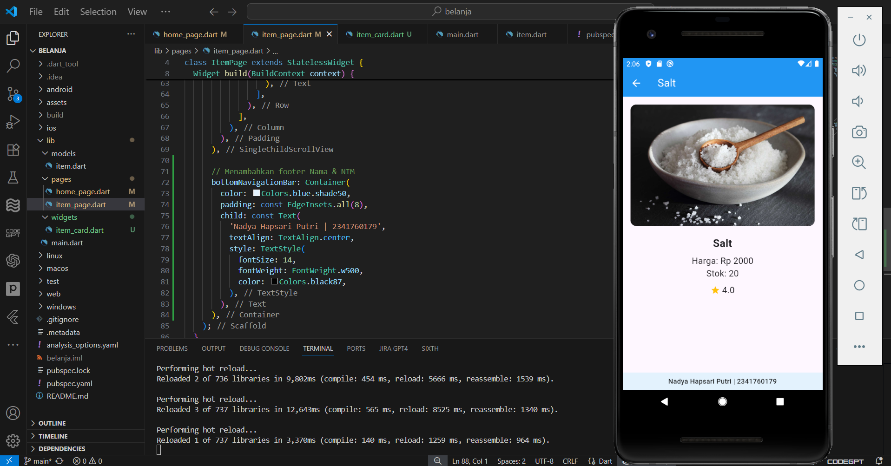

# belanja - Jobsheet 5: Navigasi dan Rute

A new Flutter project.

**Nama:** Nadya Hapsari Putri  
**NIM:** 2341760179  
**Kelas:** SIB 3D

---

## Praktikum 5

### Penjelasan Singkat
- Membuat dua halaman, yaitu `HomePage` dan `ItemPage`.  
- Menambahkan navigasi menggunakan `Navigator.pushNamed` dan `ModalRoute` untuk mengirim data antar halaman.  
- Menampilkan daftar produk menggunakan `GridView` dan `Card`.  
- Setiap item bisa ditekan dan menampilkan detail produk di halaman berikutnya.

## Hasil Akhir Praktikum 5
Halaman Home Page
  

Halaman Item Page
 

---

## Tugas Praktikum 2

### Penjelasan Singkat
- Menambahkan atribut **gambar, stok, dan rating** pada model `Item`.  
- Mengubah tampilan menjadi `GridView` seperti marketplace.  
- Menambahkan animasi transisi gambar dengan `Hero widget`.  
- Memecah widget ke file terpisah (`item_card.dart`) agar rapi.  
- Menambahkan **footer** dengan Nama dan NIM.  
- Mencoba navigasi menggunakan plugin `go_router`.

## Hasil Akhir Tugas Praktikum 2
Halaman Home Page
 

Halaman Item Page
 

---
