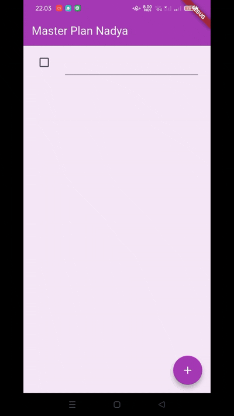

# 📘 Jobsheet 10 – Dasar State Management  
**Nama:** Nadya Hapsari Putri  
**Mata Kuliah:** Pemrograman Mobile  

---

## 🟣 Praktikum 1 – Dasar State dengan Model–View  

### Deskripsi Singkat
Pada praktikum ini dibuat aplikasi sederhana bernama **Master Plan**, yang bertujuan untuk memahami konsep dasar *state management* menggunakan pola **Model–View**. Aplikasi ini menampilkan daftar tugas (task) yang bisa ditambahkan, diedit, dan ditandai selesai menggunakan checkbox.  

---

### Hasil Akhir
Tampilan aplikasi berhasil menampilkan daftar tugas dinamis dengan judul **Master Plan Nadya**, tombol **(+)** untuk menambah task, serta kolom teks dan checkbox untuk setiap item.  
Perubahan pada teks atau status centang langsung memperbarui tampilan melalui penggunaan `setState()`.

---

### Penjelasan Singkat
- File `data_layer.dart` digunakan untuk menghubungkan file model agar proses import lebih mudah.  
- Variabel `plan` berfungsi menyimpan daftar tugas utama dan dibuat sebagai konstanta agar data bersifat tetap.  
- Widget `ListTile` menampilkan task dengan checkbox dan kolom teks.  
- Method `initState()` digunakan untuk inisialisasi, sedangkan `dispose()` untuk membersihkan resource saat widget ditutup.  

---

## 🟣 Praktikum 2 – InheritedWidget dan InheritedNotifier  

### Deskripsi Singkat
Pada praktikum ini, aplikasi **Master Plan** diperbarui dengan memisahkan *data layer* menggunakan **InheritedWidget** agar data dapat diakses lintas widget tanpa harus mengoper variabel secara langsung.  
Dengan cara ini, model data `Plan` menjadi lebih terpisah dari `PlanScreen`, sehingga pengelolaan state lebih rapi dan efisien.

---

### Hasil Akhir
Setelah langkah 9, aplikasi menampilkan daftar tugas (*task list*) dan di bagian bawah muncul teks kemajuan seperti:  
**“2 out of 5 tasks”**  
yang akan berubah otomatis setiap kali pengguna mencentang atau menambah task baru.

---

### Penjelasan Singkat
- Data `Plan` kini dikelola oleh **PlanProvider** menggunakan `InheritedNotifier`.
- `ValueListenableBuilder` digunakan untuk membangun ulang tampilan setiap kali data berubah.
- `SafeArea` ditambahkan untuk menampilkan pesan progres penyelesaian tugas.

---
