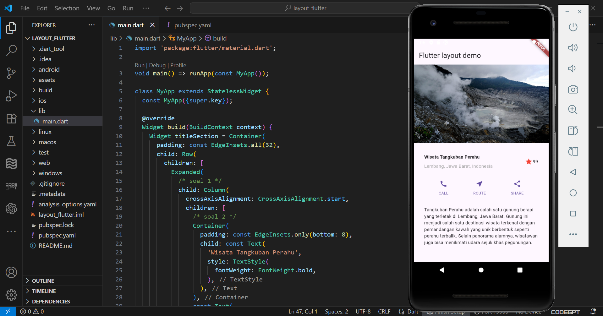

# layout_flutter - Jobsheet Layout dan Navigasi

A new Flutter project.

**Nama:** [Nadya Hapsari Putri]  
**NIM:** [2341760179]  
**Kelas:** [SIB 3D]

---

## Hasil Akhir Praktikum 1–4
Berikut adalah hasil akhir dari Praktikum 1–4 yang telah saya kerjakan.

**Penjelasan Singkat:**
- Praktikum 1: Membuat layout dasar (Image, Title Section, Button Section, Text Section).
- Praktikum 2: Menambahkan widget tambahan sesuai instruksi.
- Praktikum 3: Menyusun tata letak lebih kompleks sesuai jobsheet.
- Praktikum 4: Implementasi navigasi dasar.
- Hasil akhirnya adalah aplikasi Flutter dengan layout lengkap dan navigasi sesuai arahan jobsheet.