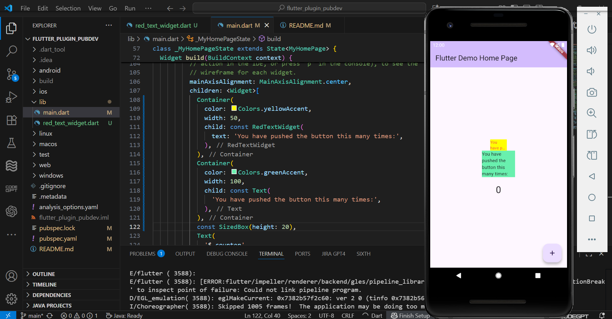

# flutter_plugin_pubdev
Praktikum Jobsheet 6 – Menerapkan Plugin di Project Flutter

## Hasil Praktikum
Aplikasi berhasil dijalankan dan menampilkan dua teks berbeda:
1. Teks merah di dalam kotak kuning menggunakan `AutoSizeText`.
2. Teks biasa di dalam kotak hijau menggunakan widget `Text`.

Berikut tampilan hasilnya:

## Penjelasan Singkat
- **Langkah 1:** Membuat project Flutter baru bernama `flutter_plugin_pubdev` dan menambahkannya ke repository GitHub.  
- **Langkah 2:** Menambahkan plugin `auto_size_text` agar dapat menggunakan widget teks yang otomatis menyesuaikan ukuran huruf.  
- **Langkah 3–5:** Membuat file `red_text_widget.dart`, menambahkan `AutoSizeText`, serta menambahkan variabel `text` dan parameter konstruktor.  
- **Langkah 6:** Menambahkan dua widget `Container` di `main.dart` untuk membandingkan hasil `AutoSizeText` dengan `Text` biasa.  

## Kesimpulan
Praktikum berhasil dilakukan, aplikasi berjalan dengan baik, dan perbedaan antara `AutoSizeText` dan `Text` dapat terlihat dengan jelas.
