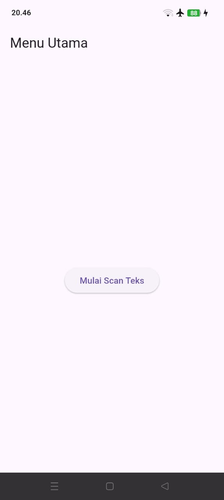
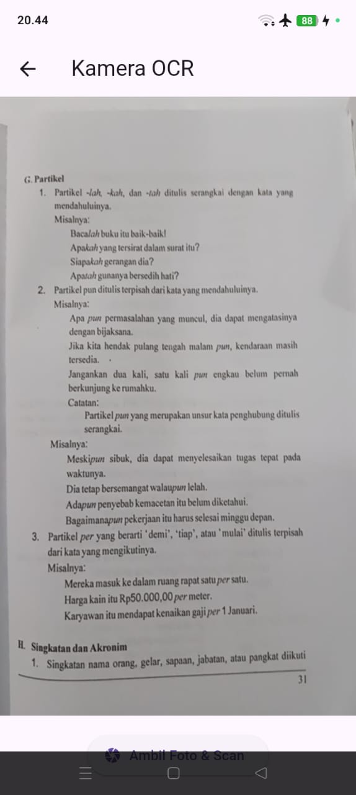
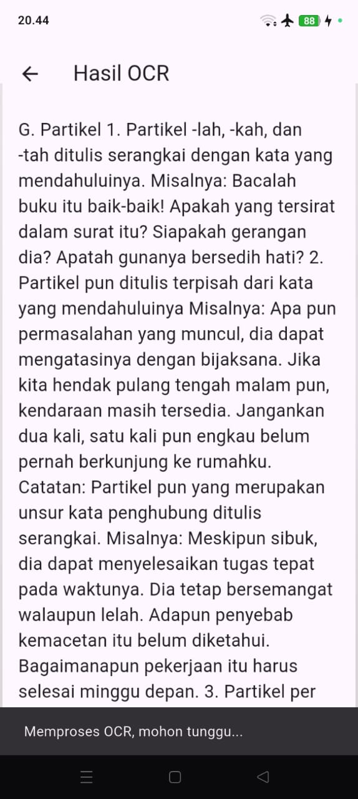
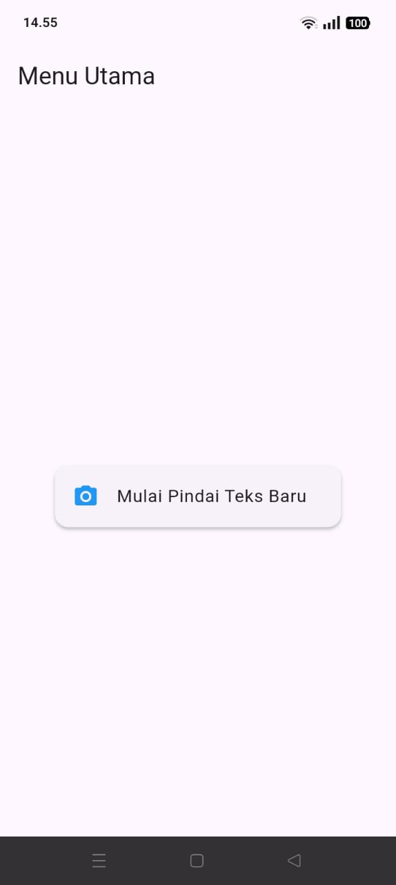
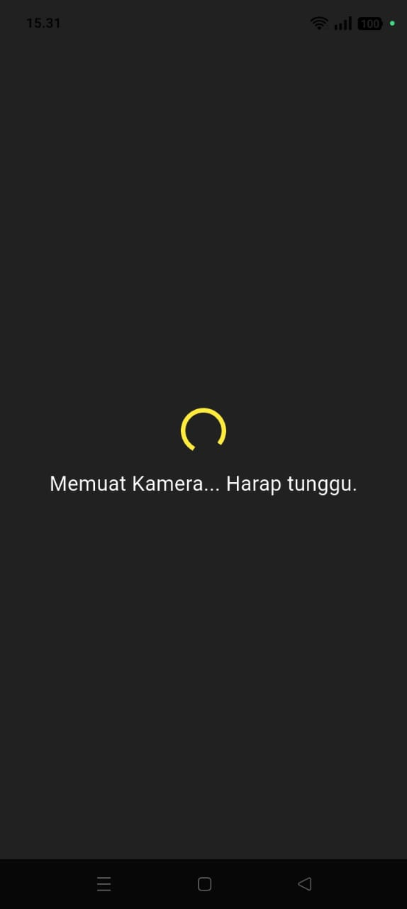
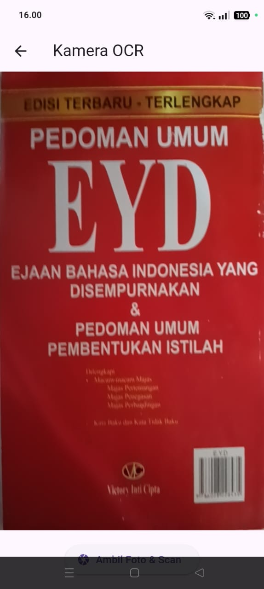
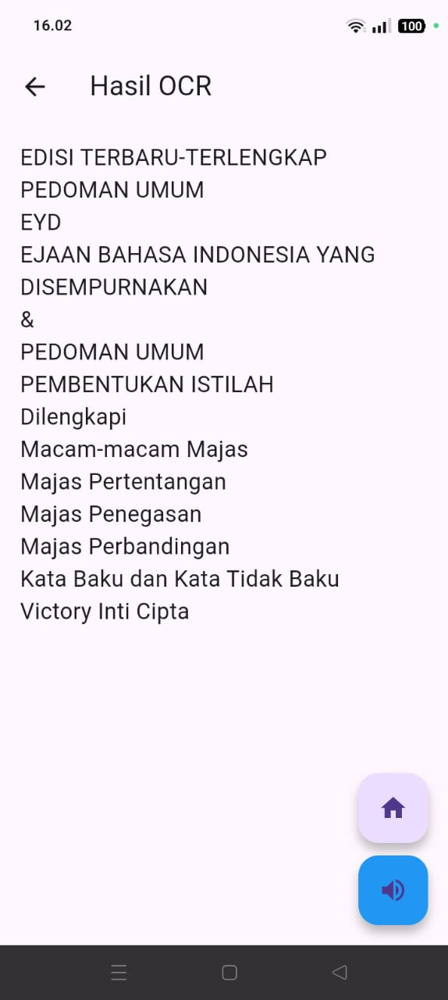

# Proyek Flutter: Aplikasi OCR Sederhana

--- 

Nama : Nadya Hapsari Putri
NIM : 2341760179
Kelas : SIB 3D
No.Absen : 16

---

## Deskripsi Singkat
Proyek ini merupakan latihan pemrograman mobile menggunakan Flutter pada pertemuan minggu ke-7.  
Aplikasi ini dibuat untuk mengenali teks dari gambar (Optical Character Recognition / OCR) dengan memanfaatkan plugin **Google ML Kit Text Recognition**.
Pengguna dapat mengambil gambar menggunakan kamera, lalu aplikasi akan menampilkan hasil teks yang terbaca dari gambar tersebut.

---

## Fitur Utama
- Mengambil gambar langsung dari kamera.  
- Melakukan proses OCR untuk mendeteksi teks dalam gambar.  
- Menampilkan hasil teks pada halaman terpisah.  
- Menggunakan navigasi antar halaman (Splash, Home, Scan, dan Result).   

---

## Hasil Tampilan Aplikasi
Berikut beberapa hasil tampilan aplikasi saat dijalankan di perangkat Android:

### Splash Screen

### Home Screen

### Scan Screen (kamera aktif)

### Hasil OCR

---

## Penjelasan Singkat Kode
Aplikasi ini terdiri dari empat layar utama:
1. Splash Screen → Tampilan awal sebelum masuk ke menu utama.  
2. Home Screen → Menyediakan tombol untuk memulai proses scan.  
3. Scan Screen → Mengaktifkan kamera dan memproses OCR.  
4. Result Screen → Menampilkan hasil teks yang berhasil dikenali.  

---

# Proyek Flutter: Aplikasi OCR Sederhana - UTS

---

## Deskripsi Singkat
Proyek ini merupakan lanjutan dari latihan minggu ke-7 yang dikembangkan untuk **Ujian Tengah Semester (UTS)** mata kuliah **Pemrograman Mobile**.  
Aplikasi Flutter ini berfungsi untuk **mengenali teks dari gambar (OCR)** menggunakan **Google ML Kit** serta menambahkan fitur **Text-to-Speech (TTS)** untuk membacakan hasil teks.  

---

## Tujuan Praktek UTS
1. Mengubah tampilan dan navigasi pada halaman Home menggunakan ListTile.  
2. Menampilkan hasil OCR secara utuh dan menambahkan navigasi balik ke Home.  
3. Menambahkan fitur **Text-to-Speech (TTS)** agar hasil teks bisa dibacakan oleh aplikasi.  
4. Menyempurnakan tampilan loading kamera dan pesan error agar lebih informatif.  

---

## Rincian Pengerjaan

### Soal 1 — Navigasi Home dan Teks Utuh
- Mengubah tombol di Home menjadi ListTile dengan ikon kamera dan teks “Mulai Pindai Teks Baru”.  
- Navigasi menuju halaman Scan menggunakan `Navigator.push()`.  
- Menghapus pemotongan teks agar hasil OCR tampil lengkap.  

### Soal 2 — Tampilan Loading dan Navigasi Balik
- Menambahkan tampilan **loading kamera** dengan indikator dan teks “Memuat Kamera... Harap tunggu.”  
- Menambahkan tombol **FloatingActionButton** berikon Home untuk kembali langsung ke halaman utama.  
- Memperbarui pesan error jika pemindaian gagal agar lebih jelas dan informatif.  

### Soal 3 — Implementasi Text-to-Speech (TTS)
- Menambahkan plugin `flutter_tts` ke dalam proyek.  
- Mengubah halaman Result agar bisa membacakan hasil teks OCR.  
- Menambahkan tombol **speaker** di hasil OCR untuk memulai pembacaan teks.  

---

## Hasil Tampilan Aplikasi di Perangkat

### Home Screen

### Loading Page

### Scan Screen

### Result Screen

---

## Hasil Video Fitur Text-to-Speech (TTS)
Berikut dokumentasi video yang menunjukkan hasil uji coba fitur **Text-to-Speech**:  

🎥 [Lihat Video Hasil Text-to-Speech](screenshots/video_tts_demo.mp4)

Video menunjukkan aplikasi berhasil membaca hasil teks OCR dengan suara otomatis setelah tombol speaker ditekan.  

---

## Kesimpulan
Dari hasil praktek UTS ini, aplikasi berhasil:
- Menampilkan tombol navigasi di Home menggunakan ListTile.  
- Memproses hasil OCR dengan tampilan teks utuh.  
- Menampilkan pesan loading dan error secara informatif.  
- Membacakan hasil teks OCR menggunakan fitur **Text-to-Speech**.  

---
